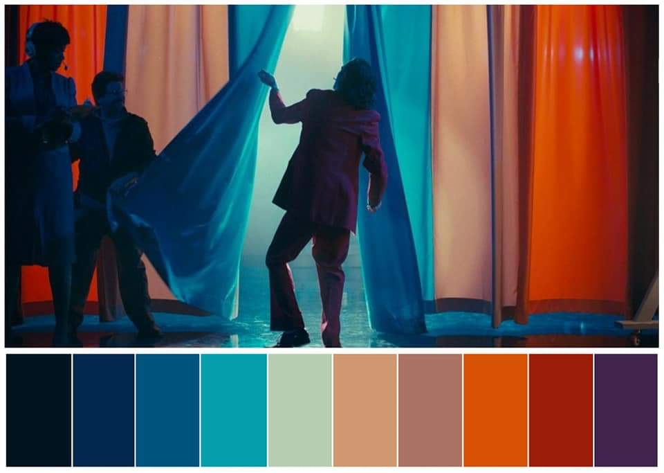

<!-- README.md is generated from README.Rmd. Please edit that file -->

```{r, include = FALSE}
knitr::opts_chunk$set(
  collapse = TRUE,
  comment = "#>",
  fig.path = "man/figures/README-",
  out.width = "100%",
  warning = FALSE,
  message = FALSE
)
library(tidyverse)
```

# cpcinema

<!-- badges: start -->
<!-- badges: end -->

cpcinema is intended to extract color palettes from the images posted by the Instagram account [\@colorpalette.cinema](https://www.instagram.com/colorpalette.cinema/). \@colorpalette.cinema takes stills from beautiful filmed and edited cinema pieces and creates a color palette containing 10 colors from the still. `cpcinema` extracts the hexcodes from one of their posts (or any image with 10 equally spaced out colors at the bottom).

## Installation

You can install the development version from [GitHub](https://github.com/) with:

``` r
# install.packages("remotes")
remotes::install_github("JosiahParry/cpcinema")
```
## Extracting Color Palettes

```{r echo=FALSE}

```
This still from the Joker (2019) contains a beautiful palette which seems like it may be suitable as a diverging color palette. We can extract these hex codes using `extract_cpc_pal()`. Note that the print method is not effectively displayed in the README. 

```{r example}
library(cpcinema)

img_path <- system.file("img/joker.jpg", package = "cpcinema")

(joker <- extract_cpc_pal(img_path))
```

`r knitr::include_graphics("inst/img/queens-gambit.png")`


```{r, message=FALSE}
pal_from_post("https://www.instagram.com/p/CHvWFaanPDQ/")
```

## Creating Color Palettes

Moreover, we are able to actually generate color palettes with more or less values than is available in our palette with the `color_palette()` function. 

```{r}
colors <- c("#842000", "#EC9B01", "#3F5D91")

my_colors <- color_palette(colors, n = 3)

my_colors
```


`color_palette()` has three arguments `pal`, `n`, and `type`. `pal` expects a character vector of hexcodes. `n` we specify how many colors from the palette should be selected. If `n` is omitted, it is the same number of values as in the palette. If it is larger than the length of `pal`, you will be prompted to change the `type` argument. There are two different arguments for `type`. These are `discrete` (the default) and `continuous`. When `type = "continuous"` we are indicating that interpolation of the colors needs to be performed.

For example, we can take the palette from above and interpolate 7 more colors by setting `n = 10` and `type = "continuous"`. 

```{r}
(colors_10 <- color_palette(colors, n = 10, "continuous"))
```


Pretty cool, huh? We can take those 10 colors and extract only 5 of them by setting `n = 5`.

```{r}
color_palette(colors_10, 5)
```

Moreover, if you'd prefer to select them manually, you can do that as well using bracket `[` indexing. 

```{r}
colors_10[c(1, 3, 6, 9)]
```


## Using color palettes

### Continuous data

```{r}
library(tidyverse)

# create some fake data
x <- expand.grid(group = 1:10, big = LETTERS) %>% 
  group_by(group) %>% 
  mutate(value = rnorm(n(), mean = group))

# plot that fake data
ggplot(x, aes(x = group, y = big, fill = value)) +
  geom_tile() + 
  scale_fill_gradientn(colours = color_palette(joker, n = 100, "continuous")) + 
  scale_x_discrete(expand = c(0, 0)) +
  scale_y_discrete(expand = c(0, 0)) + 
  coord_equal() +
  labs(x = "", y = "") 

```

### Discrete data 

```{r}
ggplot(data = palmerpenguins::penguins, aes(x = bill_length_mm, y = bill_depth_mm)) +
  geom_point(aes(color = species,
                 shape = species),
             size = 2)  +
  scale_color_manual(values = my_colors) +
  theme_light()

```


## Available palettes

There are also a number of available palettes for you right away. These are accessible through the list object `available_pals`.

## notes

This package implements an S3 `cpcinema` class using `vctrs`. The class `cpcinema` contains a `Crayon` style in the attributes for each color—this is what enables the fun printing. `cpcinema` objects will be coerced to character vectors when needed. Otherwise you can cast them explicitly with `as.character()`. To extract the `crayon` styles use `palette_style()`.

```{r}
pal <- color_palette(colors)

palette_style(pal)
```

### acknowledgments

This package was inspired by [\@karthik's](https://github.com/karthik/) [`wesanderson`](https://github.com/karthik/wesanderson) package. Additionally, [\@jesseadler's](https://github.com/jessesadler/) [`debvectrs`](https://github.com/jessesadler/debvctrs) presentation at rstudio::conf(2020L) and repository helped tremendously in getting the footing for the `vctrs` classes.
